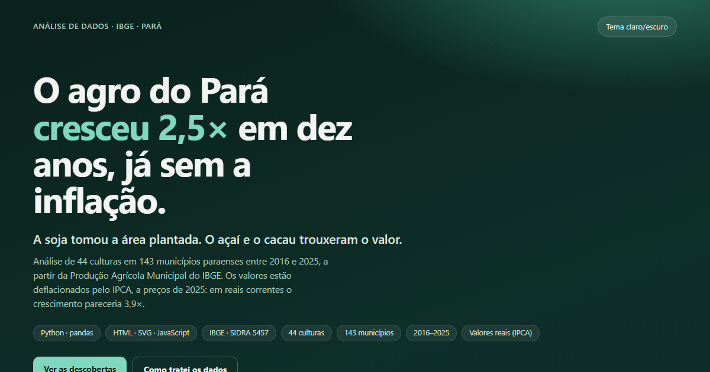

# Análise de dados sobre o agro no estado do Pará

> **O agro do Pará cresceu 2,5× em dez anos, já descontada a inflação. A soja tomou a área plantada. O açaí e o cacau trouxeram o valor.**

Análise de 44 culturas em 143 municípios paraenses entre 2016 e 2025, a partir da Produção Agrícola Municipal (PAM) do IBGE, tabela 5457 do SIDRA.

**[▶ Ver o dashboard online](https://lanybcr.github.io/Analise-de-dados-sobre-o-agro-no-estado-do-Para-/)**

[](https://lanybcr.github.io/Analise-de-dados-sobre-o-agro-no-estado-do-Para-/)

## O que a análise mostra

| Descoberta | Número |
|---|---|
| Valor da produção, 2016 → 2025, **a preços de 2025** | R$ 15,4 bi → R$ 38,4 bi (**2,5×**) |
| O mesmo em reais correntes, sem deflacionar | R$ 9,9 bi → R$ 38,4 bi (3,9×) |
| Área plantada, 2016 → 2025 | 1,57 → 3,37 milhões de ha (**2,2×**) |
| Área plantada a mais que é soja e milho | **76%** dos 1,8 milhão de ha |
| Valor novo que vem de soja, açaí e cacau | **70%** dos R$ 23,0 bi a mais |
| Açaí e cacau | 13% da área plantada, **38%** do valor |
| Soja | 39% da área plantada, 22% do valor |
| Cacau, 2023 → 2024 | valor real **3,7×** com área +2% (preço, não área) |
| Municípios com soja | 27 → 41 |

Duas leituras exigem cuidado, e o dashboard avisa nos dois casos:

- **Valor**: comparar anos sem deflacionar infla o crescimento. Aqui tudo está a preços médios de 2025 (IPCA, SIDRA tabela 1737, que acumulou 56% no período).
- **Área plantada**: a variável conta cultivos sucessivos no mesmo terreno (nota 8 do IBGE). O milho segunda safra costuma vir depois da soja na mesma terra, então "área plantada a mais" **não** é sinônimo de terra nova incorporada.

Explicações que dependem de informação de fora da base (a alta internacional do cacau em 2024, por exemplo) estão marcadas como **hipótese**.

## Estrutura do repositório

```
index.html                       dashboard (HTML + SVG + JavaScript, sem bibliotecas) — gerado por src/analise.py
capa.png                         imagem de capa / prévia de link
data/
  raw/                           exportações originais do SIDRA (2016–2020 e 2021–2025)
  tratado/                       base limpa, pronta para análise
    Culturas_Para_2016-2025_limpo.xlsx                 7 abas: producao, totais_municipio,
                                                       estado_produto_ano, produtos, a_revisar,
                                                       dicionario, log_tratamento
    Culturas_Para_2016-2025_producao.csv               município × ano × cultura
    Culturas_Para_2016-2025_totais_municipio.csv       1 linha por município/ano
    Culturas_Para_2016-2025_estado_produto_ano.csv     agregado do estado por cultura
  apoio/
    ipca_deflator.csv                                  IPCA médio anual e fator para preços de 2025
    estado_produto_ano_real.csv                        agregado com valor nominal e real
  dashboard_data.json            dados que alimentam o dashboard
src/
  tratamento_pam.py              limpeza e validação (gera data/tratado/)
  analise.py                     deflaciona, calcula os achados e gera o index.html
  dashboard_template.html        template do dashboard (marcador /*DATA*/)
docs/dashboard.png               print das seções do dashboard
```

Os CSVs usam `;` como separador, vírgula decimal e UTF-8 com BOM, para abrir direto no Excel brasileiro.

## Como os dados foram tratados

Os arquivos do SIDRA são relatórios (3 abas, cabeçalho em 3 níveis, símbolos no lugar de números), não bases analíticas. O `tratamento_pam.py`:

- junta as 3 abas de cada arquivo e os dois períodos em formato longo (município × ano × cultura);
- converte `-` em **0** (sem cultivo) e `...` em **nulo** (indisponível), nunca em zero. Só 14% das células tinham número;
- remove 41 culturas nunca cultivadas no período (44 permanecem);
- marca o café Arábica e Canephora como subcomponentes do Café Total, para não contar o café duas vezes;
- sinaliza (sem corrigir) 5 culturas que só aparecem em 2025, 27 casos de área sem valor, 152 saltos de área e 16 valores por hectare atípicos;
- valida que o Total de cada município fecha com a soma das culturas (1.420 de 1.420 casos) e que o percentual do IBGE bate com o recálculo (0 divergências).

O detalhe completo, com números, está na aba `log_tratamento` do Excel.

### Reproduzir

```bash
pip install -r requirements.txt

# 1. limpeza (gera data/tratado/)
python src/tratamento_pam.py data/raw/tabela5457_2016-2020.xlsx data/raw/tabela5457_2021-2025.xlsx --saida data/tratado --prefixo Culturas_Para_2016-2025

# 2. análise + dashboard (imprime os achados, gera data/dashboard_data.json e index.html)
python src/analise.py
```

O `analise.py` usa `data/apoio/ipca_deflator.csv`. Se o arquivo não existir, ele baixa a série do IPCA direto da API do SIDRA e o cria.

## Limitações

- **2025 é resultado preliminar** do IBGE e pode mudar na próxima divulgação.
- A base traz **área e valor**, não quantidade produzida nem rendimento. O "valor por hectare" mistura preço e produtividade, e não deve ser lido como produtividade.
- O total do município não é divulgado em 10 casos (Marituba, e Belém e Benevides em 2016). Ficam nulos, sem estimativa.
- Gergelim, cupuaçu, acerola, graviola e milho verde só têm dado a partir de 2025 (quebra de série): não comparar com os anos anteriores.
- O valor real sobe 40% em 2020 com a área +11%: a base não traz preços, então a causa (commodities, câmbio) é hipótese.
- A coluna `grupo` (grãos, frutas, perenes comerciais etc.) é uma classificação analítica deste projeto, não do IBGE.
- A série começa em 2016 porque foi o período exportado do SIDRA; 2015 não está incluído.

## Licença

O código (`src/`) e o dashboard (`index.html`) estão sob a licença [MIT](LICENSE). Os dados são do IBGE, de uso livre mediante citação da fonte.

## Autora

**Alany** · [GitHub](https://github.com/lanybcr)

## Fonte

IBGE, Produção Agrícola Municipal, tabela 5457 (SIDRA): área plantada ou destinada à colheita, percentual do total geral e valor da produção, por município do Pará. Deflator: IBGE, IPCA, tabela 1737 (número-índice, média anual).
